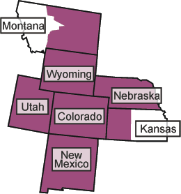

# [The call for papers and proposals](https://iliff.github.io/rmgp/CfP-2021.docx) is now open for the [2021 virtual regional conference.](http://www.rmgp.org/meetings)

### American Academy of Religion, [National Website](http://www.aarweb.org)
### Society of Biblical Literature, [National Website](http://www.sbl-site.org)

## Participating Area

Our region includes Colorado, Nebraska, New Mexico, Utah, Wyoming, western Kansas (67400-67999), and eastern Montana (59000-59399, 59500-59599).

## Regional Officers

President: [Ronald A. Simkins](mailto:rsmkns@gmail.com), Creighton University

Vice President and Program Chair: [Jeffrey Scholes](mailto:jscholes@uccs.edu), University of Colorado Colorado Springs

AAR Coordinator: [Zachary B. Smith](mailto:zacharybsmith@creighton.edu), Creighton University

SBL Coordinator: [Thomas Wayment](mailto:thomas_wayment@byu.edu), Brigham Young University

AAR Student Director: Michael Laminack, University of Denver and Iliff School of Theology

SBL Student Director: Vacant

## Past Presidents

Lincoln Blumell, Brigham Young University (2018-2019)

Elias Sacks, University of Colorado Boulder (2017-2018)

Pamela Eisenbaum, Iliff School of Theology (2016-2017)

Ronald A. Simkins, Creighton University (2015-2016)

Andrea Stanton & Gregory Robbins, University of Denver (2014-2015)

Richard S. Hess & Sung Wook Chung, Denver Seminary (2013-2014)

Dan Belnap, Brigham Young University (2012-2013)

Jacob Kinnard, Iliff School of Theology (2011-2012)

Ronald A. Simkins, Creighton University (2010-2011)

Randolph F. Lumpp, Regis University (2009-2010)

Richard Hess and Hélène Dallaire, Denver Seminary (2008-2009)

Nicolae Roddy, Creighton University (2007-2008)

David L. Weddle, The Colorado College (2006-2007)

Carl A. Raschke, Denver University (2005-2006)

Thomas A. Wayment, Brigham Young University (2004-2005)

Lynn Ross Bryant, University of Colorado, Boulder (2003-2004)

John O'Keefe, Creighton University (2002-2003)

Mark George, Iliff School of Theology (2001-2002)

Randolph F. Lumpp, Regis University (2000-2001)

Tazim Kassam, Colorado College (1999-2000)

Ronald A. Simkins, Creighton University (1998-1999)

Harris Lenowitz, University of Utah (1997-1998)

## Regional Scholars Program

The Regional Scholar’s award is a program developed by the Society of Biblical Literature’s Council of Regional Coordinators to recognize and promote promising entry-level scholars in the field of biblical studies. Its objective is to encourage their intellectual and professional development and to lend practical assistance by providing venues in which to present their work at the Society’s Regional and Annual Meetings. To qualify for the SBL Regional Scholars Program scholars should be at least ABD and no more than four years past the receipt of their Ph.D (at the time of application), and present a paper at a Regional Meeting of the Society.

Each Region of the Society of Biblical Literature may select one candidate for the Regional Scholar award. When evaluating candidates’ paper submissions, the criteria to be considered will include (where appropriate):

1. knowledge of scholarly resources and publications;
2. knowledge of the relevant languages;
3. knowledge of the primary sources;
4. ability to think critically;
5. ability to use scholarship critically by following the argument and evaluating its foundations and the validity of the reasoning;
6. clarity of writing style; and
7. originality of fresh ideas without far-fetched speculation.

If no applicant satisfies the committee’s expectations, then no Regional Scholar candidate will be selected. Regional nominations for the RS award are reviewed by a National Selection Committee of the Council for Regional Coordinators who make the final selection. Regional Scholars, once chosen, may under the auspices of the program choose a mentor to provide advice concerning their paper in preparation for the Annual Meeting and/or for publication. Officers of the regions from which the Regional Scholars are chosen will assist with extending an invitation to a mentor, if necessary.

In addition to the recognition and honor of being a Regional Scholar, each scholar will receive an award in the amount of $1000.00 to facilitate attendance at the Annual Meeting.

## Student Representatives

Both AAR and SBL have regional student positions that address the needs and concerns of graduate students and promotes their professional development and participation in our regional organization:

[AAR Graduate Student Committee](https://www.aarweb.org/node/108)

[SBL Student Advisory Board](https://www.sbl-site.org/SBLcommittees_SAB.aspx)

Student Representatives serve the regional and national organizations of AAR and SBL. As such, the region would like to offer their financial support:

Student Representatives have a waived registration fee for the regional meeting. They should contact the meeting organizer as soon as possible when registration opens to arrange this.
Student Representatives are required to pursue funding from the university with which they are affiliated before they submit requests to the region. If no such funding is available, student representatives should indicate this when requesting financial support.
Student Representatives may submit costs for hotel rooms, airfare, and food. The region requires that reimbursements for hotel rooms will be made at the AAR/SBL rate that is published by the national organizations for the annual meetings, that airfare must be coach/economy, and food will not be reimbursed higher than the annual federal per diem rates. The same requirements will apply to the regional meeting. Financial support is capped at $500 for each student representative for an academic year (one national and one regional meeting).
To receive financial support, student representatives must submit (1) itemized receipts for all costs for which they are requesting reimbursement and (2) a list of funding resources for which they have applied at their home universities (or a statement that no such funding is available) within 60 days of each meeting.
Student Representatives are expected to make every reasonable effort to be present to report on their activities at the Regional Business Meeting (scheduled each Spring at the regional meeting). 
Please contact the [current president](https://iliff.github.io/rmgp/#regional-officers) for more information.

## Regions Forum 2018

These links are the ones Elizabeth Coody referenced at the Regions Forum at the 2018 AAR/SBL Annual Meeting in Denver, Colorado where regional coordinators, officers, and representatives shared and discussed regional meeting innovations.

Katherine Downey, Dallas, TX, Presiding
Sunday, November 18, 2018 - 1:00 PM-3:00 PM
Convention Center-604 (Street Level)

#### Digital Humanities: Virtual Reality, Natural Language Processing, Machine Learning, and Artificial Intelligence

[Virtual Scriptures](http://www.virtualscriptures.org)

[A Century of Black Mormons](http://www.centuryofblackmormons.org)

[Experimental Humanities](https://www.iliff.edu/experimental-humanities/)

This rmgp.org website was created by Elizabeth Coody (2016-19 AAR Regional Coordinator for the RMGP) and is maintained by Zachary B. Smith, AAR Regional Coordinator for the RMGP Region. If you have questions, additions, or corrections to the website, please [contact me](mailto:zacharybsmith@creighton.edu).
        

